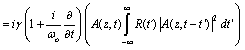
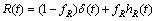
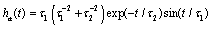
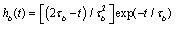
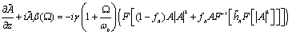

# Optimum integration procedures for supercontinuum simulations
# (Optimized GNLSE Solvers)

Matlab scripts for complete Raman response simulations using different step-size algorithms in combination with the Interaction Picture Method
(This scripts were used in the paper A.A. Rieznik, A.M. Heidt, P. G. Konig, V. Bettachini, and D. F. Grosz,   "[Optimum integration procedures for supercontinuum simulations](http://www.freeopticsproject.org/DDL1/PTL_Supercontinuum_Simulations_v6.doc)" submitted to Photonics Technologies Letters.)

These scripts simulate femto-second soliton pulses, with kWs of peak power, propagating through a highly non-linear Photonic Crystal Fiber (PCF).

For this purpose, the Generalized Non-Linear Schrödinger Equation (GNLSE) is solved.

When implementing this solution one must chose an efficient adaptive stepsize algorithm, since to keep a constant longitudinal step has proven to be extremely inefficient.

These codes implement both, the Conservation Quantity Error Method (CQEM) and the Local Error Method (LEM), for the stepsize adaptation algorithm.

The GNLSE can be written in time domain   

where

, , , 

Or in frequency domain where Ã(z, Ω) is the Fourier transform of A(z,t) and we drop the arguments in both Ã(z,Ω) and A(z,t).   

We have shown in our submitted paper that the frequency domain formulation is far more convenient than the time domain formulation.

Since we also showed that the CQEM is more efficient than the LEM, we advise you to use the CQEM in combination with frequency domain integration in any case. The function implementing it is IP_CQEM_FD.m (see below). The other functions are distributed as part of our work and for research and educational uses.

## Content

This folder contains five matlab files (.m):

1. Supercontinuum_Generation.m: this is the file you must run in order to simulate the propagation of a soliton in a PCF. At the end of the simulation the output spectrum is shown. This file sets the fiber, numerical and input soliton parameters and then calls some of the four functions below to solve the GNLSE.

2. IP_CQEM_FD.m: this function solves the GNLSE using frequency domain integration procedures in combination with the CQEM. This method has been shown in our article to be the most efficient.

3. IP_CQEM_TD.m: this function solves the GNLSE using time domain integration procedures in combination with the CQEM.

4. IP_LEM_FD.m: this function solves the GNLSE using frequency domain integration procedures in combination with the LEM.

5. IP_LEM_TD.m: this function solves the GNLSE using time domain integration procedures in combination with the LEM.

All these codes were saved using Matlab 7.6 and Windows XP, so we are not sure whether it will work properly when using earlier versions or others operational systems or hardware.

## Running the code
These codes are quite well commented, but if you have any doubt do not hesitate in contact us.

## Contact

The author of these codes  [Andrés Anibal Rieznik](http://www.freeopticsproject.org/Andres.html) . If you have inquiries about the codes, do not hesitate to send me an e-mail.
