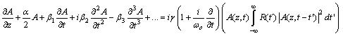
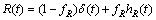
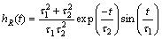

# Femtosecond soliton source with fast and broad spectal tunability

# (SSFM with Raman)

Matlab scripts for complete Raman response simulations (used in the paper Martin E. Masip, A.A. Rieznik, Pablo G. Konig, Diego F. Grosz, Andrea V. BRagas, and Oscar E. Martinez, "Femtosecond soliton source with fast and broad spectal tunability", Optics Letters, Vol. 34, No. 6, 842-844 (2009).)
ATTENTION: Optimized methods, with adaptative step-size algorithms in combination with the Interaction Picture Method (instead of the split-step Fourier Method) are now available  here . These new scripts solve the same set of equations, but are faster (sometimes orders of magnitude faster for the same precision level). They just do not include the Raman ASE term (see below).

These scripts simulate femto-second soliton pulses, with kWs of peak power, propagating through a highly non-linear Photonic Crystal Fiber (PCF). For this purpose, the function SSFM_with_Raman is called, which solves the following equation:

where

and

The codes are quite well commented, but if you have any doubt do not hesitate in contact us.

## Installation and Running the code

You must save the compressed folder called Soliton_In_PCF.zip in your computer. When you extract it, four matlab files (.m) will be created inside the folder Soliton_In_PCF:

Soliton_in_PCF.m: this is the file you must run un order to simulate the propagation of a soliton in a PCF. At the end of the simulation, five plots will be automatically generated in order to show the input and output spectra and pulse shapes.

Soliton_in_PCF_betaw.m: this is the is almost equal to the previous one, but instead of using the dispersion coefficients beta1 and beta2, it loads the measured curve beta2(w) and uses it during propagation.

SSFM_with_Raman.m: this is the function which solves the above equations.

SSFM_with_Raman_ASE.m: this is the function which solves the above equations, but inlcuding the ASE noise term (see below).

UPM_SSFM.m: this function solves the conventional NLSE, without the Raman effects, i.e., when the non-linear part of the above equation is set as i*gamma*abs(A)^2. The spatial step size is chosen using the algorithm we introduced in [1].

Two other files will be created inside the folder Soliton_In_PCF: beta2w_Thz.mat and Frequencies_for_beta2.mat. These files contain the measured values of beta2(w) and the corresponding frequencies, respectively, for the PCF we are using in our experiments. These files are loaded when running the Soliton_in_PCF_betaw.m file.

All these codes were saved using Matlab 7.0 and Windows XP, so we are not sure whether it will work properly when using earlier versions or others operational systems or hardware.

## Inclusion of the Raman ASE term

Although we dont include this term in the equation we solved for the paper, we also share here a file, SSFM_with_Raman_ASE.m, which solves the equation containing it (see [2]):

where the last term has frequency-domain correlation given by

and

and U is the Heaviside step function, with .

## Contact

The author of these codes is  [Andrés Anibal Rieznik](http://www.freeopticsproject.org/Andres.html) . If you have inquiries about the codes, do not hesitate to send me an e-mail. It would be a pleasure to answer you and help to improve these codes according to your research or educational purposes.

## Reference

[1] A. A. Rieznik, T. Tolisano, F. A. Callegari, D. F. Grosz, and H. L. Fragnito, "Uncertainty relation for the optimization of optical-fiber transmission systems simulations," Opt. Express, 13, 3822-3834 (2005).
[http://www.opticsexpress.org/abstract.cfm?URI=OPEX-13-10-3822](http://www.opticsexpress.org/abstract.cfm?URI=OPEX-13-10-3822)

[2] John M. Dudley, Goery Genty, and Stephane Coen, "Spercontinuum generation in photonic crystal fiber," Reviews of Modern Physics, 78, 1135-1184 (2006).
